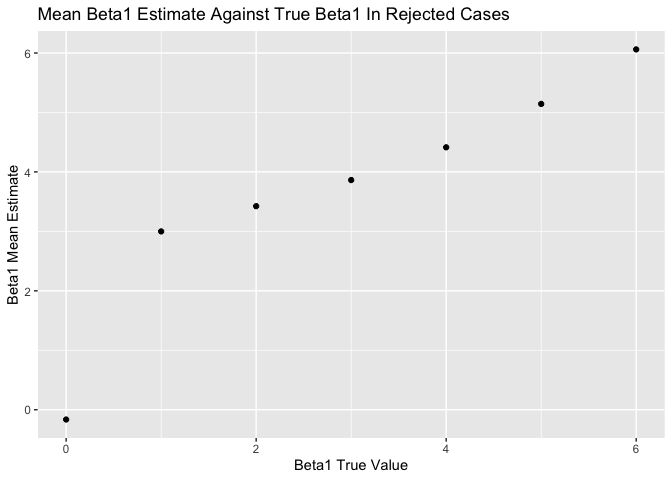

HW5
================
CC
11/6/2019

# Problem 1: Iris Missing Data

For numeric variables (Sepal.Length, Sepal.Width, Petal.Length, and
Petal.Width), fill in missing values with the mean of non-missing
values. For the character variable (Species) replace the missing values
with “virginica”. Use a map
    statement.

## Loading Dataset

``` r
library(tidyverse)
```

    ## ── Attaching packages ───────────────────────────────────────────────── tidyverse 1.2.1 ──

    ## ✔ ggplot2 3.2.1     ✔ purrr   0.3.2
    ## ✔ tibble  2.1.3     ✔ dplyr   0.8.3
    ## ✔ tidyr   1.0.0     ✔ stringr 1.4.0
    ## ✔ readr   1.3.1     ✔ forcats 0.4.0

    ## ── Conflicts ──────────────────────────────────────────────────── tidyverse_conflicts() ──
    ## ✖ dplyr::filter() masks stats::filter()
    ## ✖ dplyr::lag()    masks stats::lag()

``` r
library(purrr)

set.seed(10)
iris_with_missing = iris %>%
  map_df(~replace(.x, sample(1:150,20), NA)) %>%
  mutate(Species = as.character(Species))
```

## Cleaning dataset names and trying map statement

``` r
im = 
iris_with_missing %>%
  janitor::clean_names()

output <- vector("list", length = ncol(iris_with_missing))

na_replace <- function(x) {
  if (is.numeric(x)) {
    replace_na(x, mean(x, na.rm = TRUE))
  } else if (is.character(x)) {
    replace_na(x, "virginica")
  }
}

output = map(iris_with_missing, na_replace)
```

## Different Method

Filling in missing values with a different method. Using summary(im)
showed that the mean values for the numeric values were as follows:
sepal\_length = 5.819, sepal\_width = 3.075, petal\_length = 3.765, and
petal\_width = 1.192. Replace individually and recheck summary to ensure
NAs no longer present.

``` r
summary(im)
```

    ##   sepal_length    sepal_width     petal_length    petal_width   
    ##  Min.   :4.300   Min.   :2.000   Min.   :1.000   Min.   :0.100  
    ##  1st Qu.:5.100   1st Qu.:2.800   1st Qu.:1.600   1st Qu.:0.300  
    ##  Median :5.700   Median :3.000   Median :4.400   Median :1.300  
    ##  Mean   :5.819   Mean   :3.075   Mean   :3.765   Mean   :1.192  
    ##  3rd Qu.:6.400   3rd Qu.:3.400   3rd Qu.:5.100   3rd Qu.:1.800  
    ##  Max.   :7.900   Max.   :4.400   Max.   :6.900   Max.   :2.500  
    ##  NA's   :20      NA's   :20      NA's   :20      NA's   :20     
    ##    species         
    ##  Length:150        
    ##  Class :character  
    ##  Mode  :character  
    ##                    
    ##                    
    ##                    
    ## 

``` r
im$sepal_length <- replace_na(im$sepal_length, 5.819)
im$sepal_width <- replace_na(im$sepal_width, 3.075)
im$petal_length <- replace_na(im$petal_length, 3.765)
im$petal_width <- replace_na(im$petal_width, 1.192)
im$species <- replace_na(im$species, "virginica")

summary(im)
```

    ##   sepal_length    sepal_width     petal_length    petal_width   
    ##  Min.   :4.300   Min.   :2.000   Min.   :1.000   Min.   :0.100  
    ##  1st Qu.:5.125   1st Qu.:2.825   1st Qu.:1.700   1st Qu.:0.400  
    ##  Median :5.819   Median :3.075   Median :4.000   Median :1.200  
    ##  Mean   :5.819   Mean   :3.075   Mean   :3.765   Mean   :1.192  
    ##  3rd Qu.:6.375   3rd Qu.:3.275   3rd Qu.:4.975   3rd Qu.:1.800  
    ##  Max.   :7.900   Max.   :4.400   Max.   :6.900   Max.   :2.500  
    ##    species         
    ##  Length:150        
    ##  Class :character  
    ##  Mode  :character  
    ##                    
    ##                    
    ## 

# Problem 2: Longitudinal Study

``` r
file_names_df = tibble(
  file_names = list.files(path = "./data/")
)

read_data <- function(file_name) {
  read_csv(paste0("data/", file_name))
}

study_data_import =
  file_names_df %>%
  mutate(study_data = map(file_names_df[[1]], read_data))
```

    ## Parsed with column specification:
    ## cols(
    ##   week_1 = col_double(),
    ##   week_2 = col_double(),
    ##   week_3 = col_double(),
    ##   week_4 = col_double(),
    ##   week_5 = col_double(),
    ##   week_6 = col_double(),
    ##   week_7 = col_double(),
    ##   week_8 = col_double()
    ## )
    ## Parsed with column specification:
    ## cols(
    ##   week_1 = col_double(),
    ##   week_2 = col_double(),
    ##   week_3 = col_double(),
    ##   week_4 = col_double(),
    ##   week_5 = col_double(),
    ##   week_6 = col_double(),
    ##   week_7 = col_double(),
    ##   week_8 = col_double()
    ## )
    ## Parsed with column specification:
    ## cols(
    ##   week_1 = col_double(),
    ##   week_2 = col_double(),
    ##   week_3 = col_double(),
    ##   week_4 = col_double(),
    ##   week_5 = col_double(),
    ##   week_6 = col_double(),
    ##   week_7 = col_double(),
    ##   week_8 = col_double()
    ## )
    ## Parsed with column specification:
    ## cols(
    ##   week_1 = col_double(),
    ##   week_2 = col_double(),
    ##   week_3 = col_double(),
    ##   week_4 = col_double(),
    ##   week_5 = col_double(),
    ##   week_6 = col_double(),
    ##   week_7 = col_double(),
    ##   week_8 = col_double()
    ## )
    ## Parsed with column specification:
    ## cols(
    ##   week_1 = col_double(),
    ##   week_2 = col_double(),
    ##   week_3 = col_double(),
    ##   week_4 = col_double(),
    ##   week_5 = col_double(),
    ##   week_6 = col_double(),
    ##   week_7 = col_double(),
    ##   week_8 = col_double()
    ## )
    ## Parsed with column specification:
    ## cols(
    ##   week_1 = col_double(),
    ##   week_2 = col_double(),
    ##   week_3 = col_double(),
    ##   week_4 = col_double(),
    ##   week_5 = col_double(),
    ##   week_6 = col_double(),
    ##   week_7 = col_double(),
    ##   week_8 = col_double()
    ## )
    ## Parsed with column specification:
    ## cols(
    ##   week_1 = col_double(),
    ##   week_2 = col_double(),
    ##   week_3 = col_double(),
    ##   week_4 = col_double(),
    ##   week_5 = col_double(),
    ##   week_6 = col_double(),
    ##   week_7 = col_double(),
    ##   week_8 = col_double()
    ## )
    ## Parsed with column specification:
    ## cols(
    ##   week_1 = col_double(),
    ##   week_2 = col_double(),
    ##   week_3 = col_double(),
    ##   week_4 = col_double(),
    ##   week_5 = col_double(),
    ##   week_6 = col_double(),
    ##   week_7 = col_double(),
    ##   week_8 = col_double()
    ## )
    ## Parsed with column specification:
    ## cols(
    ##   week_1 = col_double(),
    ##   week_2 = col_double(),
    ##   week_3 = col_double(),
    ##   week_4 = col_double(),
    ##   week_5 = col_double(),
    ##   week_6 = col_double(),
    ##   week_7 = col_double(),
    ##   week_8 = col_double()
    ## )
    ## Parsed with column specification:
    ## cols(
    ##   week_1 = col_double(),
    ##   week_2 = col_double(),
    ##   week_3 = col_double(),
    ##   week_4 = col_double(),
    ##   week_5 = col_double(),
    ##   week_6 = col_double(),
    ##   week_7 = col_double(),
    ##   week_8 = col_double()
    ## )
    ## Parsed with column specification:
    ## cols(
    ##   week_1 = col_double(),
    ##   week_2 = col_double(),
    ##   week_3 = col_double(),
    ##   week_4 = col_double(),
    ##   week_5 = col_double(),
    ##   week_6 = col_double(),
    ##   week_7 = col_double(),
    ##   week_8 = col_double()
    ## )
    ## Parsed with column specification:
    ## cols(
    ##   week_1 = col_double(),
    ##   week_2 = col_double(),
    ##   week_3 = col_double(),
    ##   week_4 = col_double(),
    ##   week_5 = col_double(),
    ##   week_6 = col_double(),
    ##   week_7 = col_double(),
    ##   week_8 = col_double()
    ## )
    ## Parsed with column specification:
    ## cols(
    ##   week_1 = col_double(),
    ##   week_2 = col_double(),
    ##   week_3 = col_double(),
    ##   week_4 = col_double(),
    ##   week_5 = col_double(),
    ##   week_6 = col_double(),
    ##   week_7 = col_double(),
    ##   week_8 = col_double()
    ## )
    ## Parsed with column specification:
    ## cols(
    ##   week_1 = col_double(),
    ##   week_2 = col_double(),
    ##   week_3 = col_double(),
    ##   week_4 = col_double(),
    ##   week_5 = col_double(),
    ##   week_6 = col_double(),
    ##   week_7 = col_double(),
    ##   week_8 = col_double()
    ## )
    ## Parsed with column specification:
    ## cols(
    ##   week_1 = col_double(),
    ##   week_2 = col_double(),
    ##   week_3 = col_double(),
    ##   week_4 = col_double(),
    ##   week_5 = col_double(),
    ##   week_6 = col_double(),
    ##   week_7 = col_double(),
    ##   week_8 = col_double()
    ## )
    ## Parsed with column specification:
    ## cols(
    ##   week_1 = col_double(),
    ##   week_2 = col_double(),
    ##   week_3 = col_double(),
    ##   week_4 = col_double(),
    ##   week_5 = col_double(),
    ##   week_6 = col_double(),
    ##   week_7 = col_double(),
    ##   week_8 = col_double()
    ## )
    ## Parsed with column specification:
    ## cols(
    ##   week_1 = col_double(),
    ##   week_2 = col_double(),
    ##   week_3 = col_double(),
    ##   week_4 = col_double(),
    ##   week_5 = col_double(),
    ##   week_6 = col_double(),
    ##   week_7 = col_double(),
    ##   week_8 = col_double()
    ## )
    ## Parsed with column specification:
    ## cols(
    ##   week_1 = col_double(),
    ##   week_2 = col_double(),
    ##   week_3 = col_double(),
    ##   week_4 = col_double(),
    ##   week_5 = col_double(),
    ##   week_6 = col_double(),
    ##   week_7 = col_double(),
    ##   week_8 = col_double()
    ## )
    ## Parsed with column specification:
    ## cols(
    ##   week_1 = col_double(),
    ##   week_2 = col_double(),
    ##   week_3 = col_double(),
    ##   week_4 = col_double(),
    ##   week_5 = col_double(),
    ##   week_6 = col_double(),
    ##   week_7 = col_double(),
    ##   week_8 = col_double()
    ## )
    ## Parsed with column specification:
    ## cols(
    ##   week_1 = col_double(),
    ##   week_2 = col_double(),
    ##   week_3 = col_double(),
    ##   week_4 = col_double(),
    ##   week_5 = col_double(),
    ##   week_6 = col_double(),
    ##   week_7 = col_double(),
    ##   week_8 = col_double()
    ## )

``` r
study_data_tidy =
  study_data_import %>%
  unnest() %>%
  gather(key = week, value = observation, week_1:week_8) %>%
  separate(file_names, into = c("study_arm", "subject_id"), sep = "\\_") %>%
  mutate(
    subject_id = str_replace(subject_id, "\\.csv", ""),
    subject_id = str_remove(subject_id, "^0+"),
    week = str_replace(week, "\\week_", ""),
    study_arm = recode(study_arm, con = "Control", exp = "Experimental"))
```

    ## Warning: `cols` is now required.
    ## Please use `cols = c(study_data)`

``` r
study_data_tidy
```

    ## # A tibble: 160 x 4
    ##    study_arm subject_id week  observation
    ##    <chr>     <chr>      <chr>       <dbl>
    ##  1 Control   1          1            0.2 
    ##  2 Control   2          1            1.13
    ##  3 Control   3          1            1.77
    ##  4 Control   4          1            1.04
    ##  5 Control   5          1            0.47
    ##  6 Control   6          1            2.37
    ##  7 Control   7          1            0.03
    ##  8 Control   8          1           -0.08
    ##  9 Control   9          1            0.08
    ## 10 Control   10         1            2.14
    ## # … with 150 more rows

``` r
study_data_tidy %>%
  ggplot(aes(x = week, y = observation, color = subject_id, group = subject_id)) +
  geom_line() + 
  facet_grid(~study_arm) +
  labs(
    title = "Observations Over 8 Weeks",
    x = "Week",
    y = "Observation",
    color = "Participant") +
  viridis::scale_color_viridis(discrete = TRUE)
```

<!-- -->

# Problem 3: Regression

Running models

``` r
set.seed(10)

sim_regression = function(beta1, n = 30, beta0 = 2, sd =50^(.5)) {
  
  sim_data = tibble(
    x = rnorm(n, mean = 0, sd = 1),
    y = beta0 + beta1 * x + rnorm(n, mean = 0, 50^(.5))
  )
  
  fit_line = lm(y ~ x, data = sim_data) %>% 
    broom::tidy()
  
  tibble(
    b1_estimate = fit_line[[2,2]],
    p_value = fit_line[[2,5]]
  )
}


set.seed(10)

sim_results = rerun(10000, sim_regression(beta1 = 0)) %>%
  bind_rows()

sim_results
```

    ## # A tibble: 10,000 x 2
    ##    b1_estimate p_value
    ##          <dbl>   <dbl>
    ##  1      -2.44   0.0895
    ##  2      -0.366  0.769 
    ##  3       2.10   0.0917
    ##  4      -0.963  0.431 
    ##  5       1.61   0.192 
    ##  6       0.213  0.880 
    ##  7      -1.99   0.219 
    ##  8       2.15   0.252 
    ##  9       0.421  0.773 
    ## 10       0.685  0.532 
    ## # … with 9,990 more rows

``` r
results_10k =
  tibble(b1 = c(0, 1, 2, 3, 4, 5, 6)) %>%
  mutate(
    output_lists = map(.x = b1, ~rerun(10000, sim_regression(beta1 = .x))),
    output_df = map(output_lists, bind_rows)) %>%
  select(-output_lists) %>%
  unnest(output_df)
```

Plotting proportion of times the null was rejected (i.e. power) on
y-axis and true value of Beta1 on x axis. Describe the association
between effect size and power.

``` r
results_10k %>%
  mutate(reject = ifelse(p_value < 0.05, "yes", "no"), reject = as.factor(reject)) %>%
  group_by(b1, reject) %>%
  count(reject) %>%
  mutate(freq = (n/100)) %>%
  filter(reject == "yes") %>%
  ggplot(aes(x = b1, y = freq)) + geom_point() +
  labs(title = "Association Between Power and Effect Size",
       x = "Beta1 True Value",
       y = "Power")
```

<!-- -->

Plot average estimates of Beta1hat on y-axis and true values of Beta1 on
x-axis. On separate plot, show average estimate of Beta1hat in samples
for which the null was rejected on the y-axis and the true value of
Beta1 on the x axis.

``` r
graph_1 = 
  results_10k %>%
  mutate(reject = ifelse(p_value < 0.05, "yes", "no"),
         reject = as.factor(reject)) %>%
  group_by(b1) %>%
  summarise(est_b1_mean = mean(b1_estimate)) %>%
  ggplot(aes(x = b1, y = est_b1_mean)) + geom_point() +
  labs(title = "Mean Beta1 Estimate Against True Beta1 in All Observations",
       x = "Beta1 True Value",
       y = "Beta1 Mean Estimate")

graph_2 =
  results_10k %>%
  mutate(reject = ifelse(p_value < 0.05, "yes", "no"),
         reject = as.factor(reject)) %>%
  group_by(b1) %>%
  filter(reject == "yes") %>%
  summarise(est_b1_mean = mean(b1_estimate)) %>%
  ggplot(aes(x = b1, y = est_b1_mean)) + geom_point() +
  labs(title = "Mean Beta1 Estimate Against True Beta1 In Rejected Cases",
       x = "Beta1 True Value",
       y = "Beta1 Mean Estimate")
```

``` r
graph_1
```

<!-- -->

``` r
graph_2
```

<!-- -->
