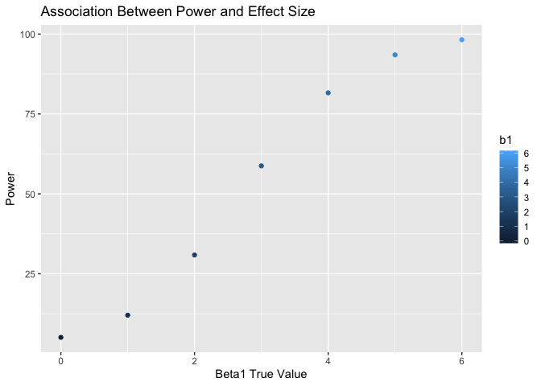
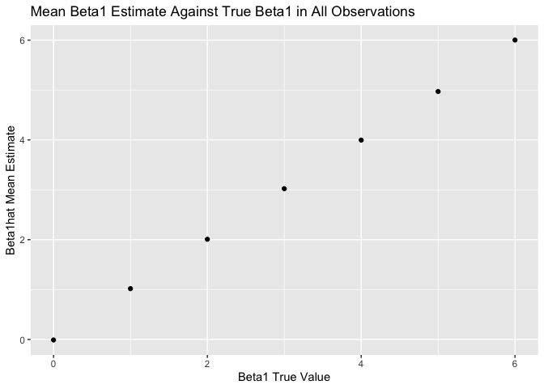
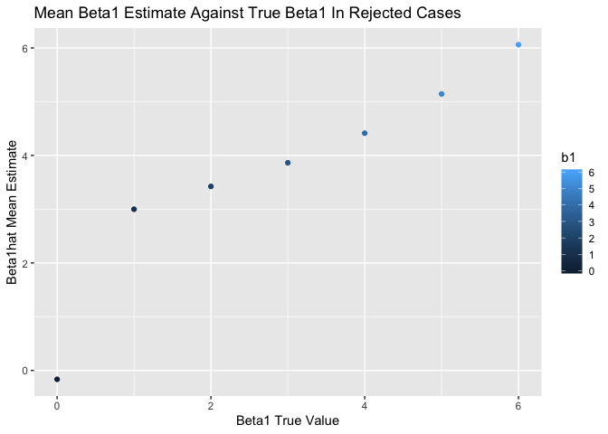

HW5
================
CC
11/6/2019

# Problem 1: Replacing NAs in Iris Missing Data

For numeric variables (Sepal.Length, Sepal.Width, Petal.Length, and
Petal.Width), fill in missing values with the mean of non-missing
values. For the character variable (Species) replace the missing values
with “virginica”. Use a map
    statement.

## Loading Dataset

``` r
library(tidyverse)
```

    ## ── Attaching packages ───────────────────────────────────────────────── tidyverse 1.2.1 ──

    ## ✔ ggplot2 3.2.1     ✔ purrr   0.3.2
    ## ✔ tibble  2.1.3     ✔ dplyr   0.8.3
    ## ✔ tidyr   1.0.0     ✔ stringr 1.4.0
    ## ✔ readr   1.3.1     ✔ forcats 0.4.0

    ## ── Conflicts ──────────────────────────────────────────────────── tidyverse_conflicts() ──
    ## ✖ dplyr::filter() masks stats::filter()
    ## ✖ dplyr::lag()    masks stats::lag()

``` r
library(purrr)

set.seed(10)
iris_with_missing = iris %>%
  map_df(~replace(.x, sample(1:150,20), NA)) %>%
  mutate(Species = as.character(Species))
```

## Cleaning Dataset & Using Map Statement to Replace NAs

``` r
im = 
iris_with_missing %>%
  janitor::clean_names()

output <- vector("list", length = ncol(iris_with_missing))

na_replace <- function(x) {
  if (is.numeric(x)) {
    replace_na(x, mean(x, na.rm = TRUE))
  } else if (is.character(x)) {
    replace_na(x, "virginica")
  }
}

output = map(iris_with_missing, na_replace)
```

Output shows no existing NA values in the dataset for any variables.

# Problem 2: Assessing Treatment Arms in a Longitudinal Study

## Reading in Data Files

``` r
file_names_df = tibble(
  file_names = list.files(path = "./data/")
)

read_data <- function(file_name) {
  read_csv(paste0("data/", file_name))
}

study_data_import =
  file_names_df %>%
  mutate(study_data = map(file_names_df[[1]], read_data))
```

    ## Parsed with column specification:
    ## cols(
    ##   week_1 = col_double(),
    ##   week_2 = col_double(),
    ##   week_3 = col_double(),
    ##   week_4 = col_double(),
    ##   week_5 = col_double(),
    ##   week_6 = col_double(),
    ##   week_7 = col_double(),
    ##   week_8 = col_double()
    ## )
    ## Parsed with column specification:
    ## cols(
    ##   week_1 = col_double(),
    ##   week_2 = col_double(),
    ##   week_3 = col_double(),
    ##   week_4 = col_double(),
    ##   week_5 = col_double(),
    ##   week_6 = col_double(),
    ##   week_7 = col_double(),
    ##   week_8 = col_double()
    ## )
    ## Parsed with column specification:
    ## cols(
    ##   week_1 = col_double(),
    ##   week_2 = col_double(),
    ##   week_3 = col_double(),
    ##   week_4 = col_double(),
    ##   week_5 = col_double(),
    ##   week_6 = col_double(),
    ##   week_7 = col_double(),
    ##   week_8 = col_double()
    ## )
    ## Parsed with column specification:
    ## cols(
    ##   week_1 = col_double(),
    ##   week_2 = col_double(),
    ##   week_3 = col_double(),
    ##   week_4 = col_double(),
    ##   week_5 = col_double(),
    ##   week_6 = col_double(),
    ##   week_7 = col_double(),
    ##   week_8 = col_double()
    ## )
    ## Parsed with column specification:
    ## cols(
    ##   week_1 = col_double(),
    ##   week_2 = col_double(),
    ##   week_3 = col_double(),
    ##   week_4 = col_double(),
    ##   week_5 = col_double(),
    ##   week_6 = col_double(),
    ##   week_7 = col_double(),
    ##   week_8 = col_double()
    ## )
    ## Parsed with column specification:
    ## cols(
    ##   week_1 = col_double(),
    ##   week_2 = col_double(),
    ##   week_3 = col_double(),
    ##   week_4 = col_double(),
    ##   week_5 = col_double(),
    ##   week_6 = col_double(),
    ##   week_7 = col_double(),
    ##   week_8 = col_double()
    ## )
    ## Parsed with column specification:
    ## cols(
    ##   week_1 = col_double(),
    ##   week_2 = col_double(),
    ##   week_3 = col_double(),
    ##   week_4 = col_double(),
    ##   week_5 = col_double(),
    ##   week_6 = col_double(),
    ##   week_7 = col_double(),
    ##   week_8 = col_double()
    ## )
    ## Parsed with column specification:
    ## cols(
    ##   week_1 = col_double(),
    ##   week_2 = col_double(),
    ##   week_3 = col_double(),
    ##   week_4 = col_double(),
    ##   week_5 = col_double(),
    ##   week_6 = col_double(),
    ##   week_7 = col_double(),
    ##   week_8 = col_double()
    ## )
    ## Parsed with column specification:
    ## cols(
    ##   week_1 = col_double(),
    ##   week_2 = col_double(),
    ##   week_3 = col_double(),
    ##   week_4 = col_double(),
    ##   week_5 = col_double(),
    ##   week_6 = col_double(),
    ##   week_7 = col_double(),
    ##   week_8 = col_double()
    ## )
    ## Parsed with column specification:
    ## cols(
    ##   week_1 = col_double(),
    ##   week_2 = col_double(),
    ##   week_3 = col_double(),
    ##   week_4 = col_double(),
    ##   week_5 = col_double(),
    ##   week_6 = col_double(),
    ##   week_7 = col_double(),
    ##   week_8 = col_double()
    ## )
    ## Parsed with column specification:
    ## cols(
    ##   week_1 = col_double(),
    ##   week_2 = col_double(),
    ##   week_3 = col_double(),
    ##   week_4 = col_double(),
    ##   week_5 = col_double(),
    ##   week_6 = col_double(),
    ##   week_7 = col_double(),
    ##   week_8 = col_double()
    ## )
    ## Parsed with column specification:
    ## cols(
    ##   week_1 = col_double(),
    ##   week_2 = col_double(),
    ##   week_3 = col_double(),
    ##   week_4 = col_double(),
    ##   week_5 = col_double(),
    ##   week_6 = col_double(),
    ##   week_7 = col_double(),
    ##   week_8 = col_double()
    ## )
    ## Parsed with column specification:
    ## cols(
    ##   week_1 = col_double(),
    ##   week_2 = col_double(),
    ##   week_3 = col_double(),
    ##   week_4 = col_double(),
    ##   week_5 = col_double(),
    ##   week_6 = col_double(),
    ##   week_7 = col_double(),
    ##   week_8 = col_double()
    ## )
    ## Parsed with column specification:
    ## cols(
    ##   week_1 = col_double(),
    ##   week_2 = col_double(),
    ##   week_3 = col_double(),
    ##   week_4 = col_double(),
    ##   week_5 = col_double(),
    ##   week_6 = col_double(),
    ##   week_7 = col_double(),
    ##   week_8 = col_double()
    ## )
    ## Parsed with column specification:
    ## cols(
    ##   week_1 = col_double(),
    ##   week_2 = col_double(),
    ##   week_3 = col_double(),
    ##   week_4 = col_double(),
    ##   week_5 = col_double(),
    ##   week_6 = col_double(),
    ##   week_7 = col_double(),
    ##   week_8 = col_double()
    ## )
    ## Parsed with column specification:
    ## cols(
    ##   week_1 = col_double(),
    ##   week_2 = col_double(),
    ##   week_3 = col_double(),
    ##   week_4 = col_double(),
    ##   week_5 = col_double(),
    ##   week_6 = col_double(),
    ##   week_7 = col_double(),
    ##   week_8 = col_double()
    ## )
    ## Parsed with column specification:
    ## cols(
    ##   week_1 = col_double(),
    ##   week_2 = col_double(),
    ##   week_3 = col_double(),
    ##   week_4 = col_double(),
    ##   week_5 = col_double(),
    ##   week_6 = col_double(),
    ##   week_7 = col_double(),
    ##   week_8 = col_double()
    ## )
    ## Parsed with column specification:
    ## cols(
    ##   week_1 = col_double(),
    ##   week_2 = col_double(),
    ##   week_3 = col_double(),
    ##   week_4 = col_double(),
    ##   week_5 = col_double(),
    ##   week_6 = col_double(),
    ##   week_7 = col_double(),
    ##   week_8 = col_double()
    ## )
    ## Parsed with column specification:
    ## cols(
    ##   week_1 = col_double(),
    ##   week_2 = col_double(),
    ##   week_3 = col_double(),
    ##   week_4 = col_double(),
    ##   week_5 = col_double(),
    ##   week_6 = col_double(),
    ##   week_7 = col_double(),
    ##   week_8 = col_double()
    ## )
    ## Parsed with column specification:
    ## cols(
    ##   week_1 = col_double(),
    ##   week_2 = col_double(),
    ##   week_3 = col_double(),
    ##   week_4 = col_double(),
    ##   week_5 = col_double(),
    ##   week_6 = col_double(),
    ##   week_7 = col_double(),
    ##   week_8 = col_double()
    ## )

## Tidy Dataset

``` r
study_data_tidy =
  study_data_import %>%
  unnest() %>%
  gather(key = week, value = observation, week_1:week_8) %>%
  separate(file_names, into = c("study_arm", "subject_id"), sep = "\\_") %>%
  mutate(
    subject_id = str_replace(subject_id, "\\.csv", ""),
    subject_id = str_remove(subject_id, "^0+"),
    week = str_replace(week, "\\week_", ""),
    study_arm = recode(study_arm, con = "Control", exp = "Experimental"))
```

    ## Warning: `cols` is now required.
    ## Please use `cols = c(study_data)`

``` r
study_data_tidy
```

    ## # A tibble: 160 x 4
    ##    study_arm subject_id week  observation
    ##    <chr>     <chr>      <chr>       <dbl>
    ##  1 Control   1          1            0.2 
    ##  2 Control   2          1            1.13
    ##  3 Control   3          1            1.77
    ##  4 Control   4          1            1.04
    ##  5 Control   5          1            0.47
    ##  6 Control   6          1            2.37
    ##  7 Control   7          1            0.03
    ##  8 Control   8          1           -0.08
    ##  9 Control   9          1            0.08
    ## 10 Control   10         1            2.14
    ## # … with 150 more rows

This dataset now differentiates between the Control and Treatment arms,
as well as showing Subject ID. Weekly observations are now easily
readable.

## Spaghetti Plot: Observations on Each Subject Arm Over Time

``` r
study_data_tidy %>%
  ggplot(aes(x = week, y = observation, color = subject_id, group = subject_id)) +
  geom_line() + 
  facet_grid(~study_arm) +
  labs(
    title = "Observations Over 8 Weeks",
    x = "Week",
    y = "Observation",
    color = "Participant") +
  viridis::scale_color_viridis(discrete = TRUE)
```

<!-- -->

In comparing the two treatment arms (control vs. experimental),
participants in the Experimental Arm had an overall greater number of
observations over time from week 1 to week 8 (clear increase). In the
Control Arm, participant observations increased and decreased over time,
but overall there didn’t appear to be as much variation between the
number of observations during week 1 as compared to week 8 for each
indidividual.

# Problem 3: Linear Regression & Power

## Running Simulated Models

``` r
set.seed(10)

sim_regression = function(beta1, n = 30, beta0 = 2, sd =50^(.5)) {
  
  sim_data = tibble(
    x = rnorm(n, mean = 0, sd = 1),
    y = beta0 + beta1 * x + rnorm(n, mean = 0, 50^(.5))
  )
  
  fit_line = lm(y ~ x, data = sim_data) %>% 
    broom::tidy()
  
  tibble(
    b1_estimate = fit_line[[2,2]],
    p_value = fit_line[[2,5]]
  )
}


set.seed(10)

sim_results = rerun(10000, sim_regression(beta1 = 0)) %>%
  bind_rows()

sim_results
```

    ## # A tibble: 10,000 x 2
    ##    b1_estimate p_value
    ##          <dbl>   <dbl>
    ##  1      -2.44   0.0895
    ##  2      -0.366  0.769 
    ##  3       2.10   0.0917
    ##  4      -0.963  0.431 
    ##  5       1.61   0.192 
    ##  6       0.213  0.880 
    ##  7      -1.99   0.219 
    ##  8       2.15   0.252 
    ##  9       0.421  0.773 
    ## 10       0.685  0.532 
    ## # … with 9,990 more rows

This table shows beta1 estimates and p-values arising from a test of H:
beta1 = 0 (null) with an alpha level of 0.05.

## Creating Table Output for Plots

``` r
results_10k =
  tibble(b1 = c(0, 1, 2, 3, 4, 5, 6)) %>%
  mutate(
    output_lists = map(.x = b1, ~rerun(10000, sim_regression(beta1 = .x))),
    output_df = map(output_lists, bind_rows)) %>%
  select(-output_lists) %>%
  unnest(output_df)
```

## Plotting Association Between Power and Effect Size

Plotting proportion of times the null was rejected (i.e. power) on
y-axis and true value of beta1 on x-axis. Describe the association
between effect size and power.

``` r
results_10k %>%
  mutate(reject = ifelse(p_value < 0.05, "yes", "no"), reject = as.factor(reject)) %>%
  group_by(b1, reject) %>%
  count(reject) %>%
  mutate(freq = (n/100)) %>%
  filter(reject == "yes") %>%
  ggplot(aes(x = b1, y = freq, color = b1)) + geom_point() +
  labs(title = "Association Between Power and Effect Size",
       x = "Beta1 True Value",
       y = "Power")
```

<!-- --> This
plot between the true value of beta1 and Power shows a proportional
relationaship between these two factors, because as effect size (beta1)
increases, so does Power; up to a point. We can see that the increases
in power taper off with higher values of effect size, suggesting a
threshold effect.

## Plotting Average Estimates of Beta1\_hat

Creating Graph 1: average estimate of beta1hat on y-axis and true values
of beta1 on x-axis.

``` r
graph_1 = 
  results_10k %>%
  mutate(reject = ifelse(p_value < 0.05, "yes", "no"),
         reject = as.factor(reject)) %>%
  group_by(b1) %>%
  summarise(est_b1_mean = mean(b1_estimate)) %>%
  ggplot(aes(x = b1, y = est_b1_mean, color = b1)) + geom_point() +
  labs(title = "Mean Beta1 Estimate Against True Beta1 in All Observations",
       x = "Beta1 True Value",
       y = "Beta1hat Mean Estimate")
graph_1
```

<!-- --> This
graph shows a directly positive linear relationship between true values
of beta1 and mean estimates of beta1.

Creating code for Graph 2: average estimate of Beta1hat in samples for
which the null was rejected on the y-axis and the true value of Beta1 on
the x axis.

``` r
graph_2 =
  results_10k %>%
  mutate(reject = ifelse(p_value < 0.05, "yes", "no"),
         reject = as.factor(reject)) %>%
  group_by(b1) %>%
  filter(reject == "yes") %>%
  summarise(est_b1_mean = mean(b1_estimate)) %>%
  ggplot(aes(x = b1, y = est_b1_mean, color = b1)) + geom_point() +
  labs(title = "Mean Beta1 Estimate Against True Beta1 In Rejected Cases",
       x = "Beta1 True Value",
       y = "Beta1hat Mean Estimate")
graph_2
```

<!-- --> This
graph shows true values of beta1 as compared to the mean estimates of
beta1hat in cases where the null hypothesis was rejected. The sample
average of beta1hat across tests for which the null is rejected begin to
approximate the true value of beta1 around when beta1 equals 4, and this
approximation improves as beta1 increases to 5 and 6. The plot suggests
that increasing effect size in the true value of beta1 relates to an
increase in beta1hat mean estimates, which may signify the likelihood of
rejecting the null hypothesis is becoming greater.
