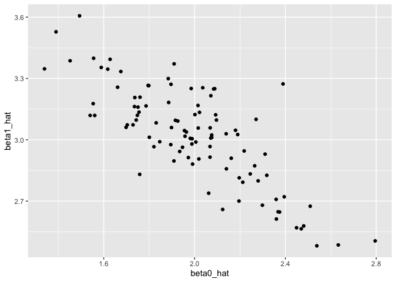

HW5
================
CC
11/6/2019

# Problem 1: Iris Missing Data

For numeric variables (Sepal.Length, Sepal.Width, Petal.Length, and
Petal.Width), fill in missing values with the mean of non-missing
values. For the character variable (Species) replace the missing values
with “virginica”. Use a map
    statement.

## Loading Dataset

``` r
library(tidyverse)
```

    ## ── Attaching packages ──────────────────────────────────────────────── tidyverse 1.2.1 ──

    ## ✔ ggplot2 3.2.1     ✔ purrr   0.3.2
    ## ✔ tibble  2.1.3     ✔ dplyr   0.8.3
    ## ✔ tidyr   1.0.0     ✔ stringr 1.4.0
    ## ✔ readr   1.3.1     ✔ forcats 0.4.0

    ## ── Conflicts ─────────────────────────────────────────────────── tidyverse_conflicts() ──
    ## ✖ dplyr::filter() masks stats::filter()
    ## ✖ dplyr::lag()    masks stats::lag()

``` r
set.seed(10)
iris_with_missing = iris %>%
  map_df(~replace(.x, sample(1:150,20), NA)) %>%
  mutate(Species = as.character(Species))
```

## Cleaning dataset names and trying map statement

``` r
im = 
iris_with_missing %>%
  janitor::clean_names()

#l = list(pull(im, sepal_length),
#        pull(im, sepal_width),
#        pull(im, petal_length),
#        pull(im, petal_width),
#        pull(im, species))

#l[[2]]


#meanf = function(x) {
#  if (!is.numeric(x)) {
#    stop("Argument x should be numeric")
#  } else if (length(x) == 1) {
#    stop("Cannot be computed for length 1 vectors")
#  }

#mean_x = mean(x)

#tibble(
#  sepal_length = mean(sepal_length),
#  sepal_width = mean(sepal_width),
#  petal_length = mean(petal_length),
#  petal_width = mean(petal_width),
#  species
#  )
#}

#meanf(iris_with_missing[[l]])

#output = map(iris_with_missing, mean)
```

## Different Method

Filling in missing values with a different method. Using summary(im)
showed that the mean values for the numeric values were as follows:
sepal\_length = 5.819, sepal\_width = 3.075, petal\_length = 3.765, and
petal\_width = 1.192. Replace individually and recheck summary to ensure
NAs no longer present.

``` r
summary(im)
```

    ##   sepal_length    sepal_width     petal_length    petal_width   
    ##  Min.   :4.300   Min.   :2.000   Min.   :1.000   Min.   :0.100  
    ##  1st Qu.:5.100   1st Qu.:2.800   1st Qu.:1.600   1st Qu.:0.300  
    ##  Median :5.700   Median :3.000   Median :4.400   Median :1.300  
    ##  Mean   :5.819   Mean   :3.075   Mean   :3.765   Mean   :1.192  
    ##  3rd Qu.:6.400   3rd Qu.:3.400   3rd Qu.:5.100   3rd Qu.:1.800  
    ##  Max.   :7.900   Max.   :4.400   Max.   :6.900   Max.   :2.500  
    ##  NA's   :20      NA's   :20      NA's   :20      NA's   :20     
    ##    species         
    ##  Length:150        
    ##  Class :character  
    ##  Mode  :character  
    ##                    
    ##                    
    ##                    
    ## 

``` r
im$sepal_length <- replace_na(im$sepal_length, 5.819)
im$sepal_width <- replace_na(im$sepal_width, 3.075)
im$petal_length <- replace_na(im$petal_length, 3.765)
im$petal_width <- replace_na(im$petal_width, 1.192)
im$species <- replace_na(im$species, "virginica")

summary(im)
```

    ##   sepal_length    sepal_width     petal_length    petal_width   
    ##  Min.   :4.300   Min.   :2.000   Min.   :1.000   Min.   :0.100  
    ##  1st Qu.:5.125   1st Qu.:2.825   1st Qu.:1.700   1st Qu.:0.400  
    ##  Median :5.819   Median :3.075   Median :4.000   Median :1.200  
    ##  Mean   :5.819   Mean   :3.075   Mean   :3.765   Mean   :1.192  
    ##  3rd Qu.:6.375   3rd Qu.:3.275   3rd Qu.:4.975   3rd Qu.:1.800  
    ##  Max.   :7.900   Max.   :4.400   Max.   :6.900   Max.   :2.500  
    ##    species         
    ##  Length:150        
    ##  Class :character  
    ##  Mode  :character  
    ##                    
    ##                    
    ## 

# Problem 2: Longitudinal Study

``` r
list.files(path = "./data/")
```

    ##  [1] "con_01.csv" "con_02.csv" "con_03.csv" "con_04.csv" "con_05.csv"
    ##  [6] "con_06.csv" "con_07.csv" "con_08.csv" "con_09.csv" "con_10.csv"
    ## [11] "exp_01.csv" "exp_02.csv" "exp_03.csv" "exp_04.csv" "exp_05.csv"
    ## [16] "exp_06.csv" "exp_07.csv" "exp_08.csv" "exp_09.csv" "exp_10.csv"

# Problem 3: Regression

Running a model when beta1 = 0

``` r
# Set design elements:
set.seed(1)
n=30

sim_regression = function(n, beta0 = 2, beta1 = 0) {
  
  sim_data = tibble(
    x = rnorm(n, mean = 1, sd = 1),
    y = beta0 + beta1 * x + rnorm(n, 0, 1)
  )
  
  ls_fit = lm(y ~ x, data = sim_data)
  
  broom::tidy(ls_fit)
  
  tibble(
    beta0_hat = coef(ls_fit)[1],
    beta1_hat = coef(ls_fit)[2]
  )
}

output = vector("list", 10000)

for (i in 1:10000) {
  output[[i]] = sim_regression(30)
}

sim_results = bind_rows(output)

sim_results = 
  rerun(10000, sim_regression(30, 2, 7.07)) %>% 
  bind_rows()

sim_results %>% 
  ggplot(aes(x = beta0_hat, y = beta1_hat)) + 
  geom_point()
```

<!-- -->

``` r
sim_results %>% 
  pivot_longer(
    beta0_hat:beta1_hat,
    names_to = "parameter", 
    values_to = "estimate") %>% 
  group_by(parameter) %>% 
  summarize(emp_mean = mean(estimate),
            emp_var = var(estimate)) %>% 
  knitr::kable(digits = 3)
```

| parameter  | emp\_mean | emp\_var |
| :--------- | --------: | -------: |
| beta0\_hat |     2.004 |    0.072 |
| beta1\_hat |     7.069 |    0.037 |

## Repeating regression
